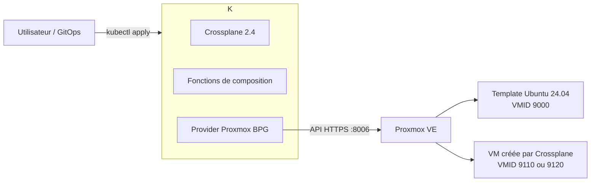

# TP — Piloter Proxmox avec Crossplane 2

Ce TP construit un petit **control plane** Kubernetes capable de créer, modifier,
surveiller et supprimer des machines virtuelles dans Proxmox VE à partir de
ressources YAML.

Versions de référence au 5 septembre 2026 :

- Crossplane : branche stable 2.4 ;
- provider Proxmox BPG : `v1.18.0` ;
- fonction Patch & Transform : `v0.10.3` ;
- fonction Auto Ready : `v0.6.3` ;
- système invité : Ubuntu Server 24.04 LTS cloud image, architecture amd64.

> **Avertissement** — Le provider Proxmox utilisé ici est communautaire et non
> officiel. Fais ce TP sur un nœud de laboratoire, avec des VMID dédiés. La
> suppression d'une ressource Crossplane supprime par défaut la VM correspondante.

## Utiliser ce dépôt

```bash
git clone https://github.com/ahouab/crossplane-proxmox-lab.git
cd crossplane-proxmox-lab
make help
python3 -m venv .venv
source .venv/bin/activate
python -m pip install -r .github/requirements-ci.txt
# Debian/Ubuntu : sudo apt-get install shellcheck
make validate
```

La procédure pour créer et publier ton propre dépôt est détaillée dans
[`docs/PUBLICATION_GITHUB.md`](docs/PUBLICATION_GITHUB.md). Aucun identifiant
Proxmox ne doit être ajouté au dépôt : le Secret est créé interactivement et
directement dans Kubernetes.

## 1. Objectifs pédagogiques

À la fin du TP, tu sauras :

1. installer un cluster Kubernetes de management sur Proxmox ;
2. installer Crossplane avec Helm ;
3. authentifier proprement un provider auprès de l'API Proxmox ;
4. créer une VM à l'aide d'une Managed Resource ;
5. construire une API interne `VirtualMachine` avec une XRD et une Composition ;
6. tester la mise à jour, la correction de dérive et la suppression ;
7. diagnostiquer les erreurs courantes.

## 2. Architecture du laboratoire



Crossplane n'est pas installé *dans* Proxmox VE. Il est installé dans Kubernetes,
ici une VM K3s hébergée sur Proxmox. Ce cluster est le plan de contrôle ; les VM
qu'il crée sont les ressources gérées.

## 3. Pré-requis

### Matériel et réseau

- Proxmox VE 8 ou 9 accessible en HTTPS depuis la VM de management ;
- un stockage de VM, supposé nommé `local-lvm` dans les exemples ;
- un bridge, supposé nommé `vmbr0` ;
- DHCP disponible sur ce bridge ;
- environ 2 vCPU, 4 Gio de RAM et 20 Gio de disque pour la VM K3s ;
- environ 2 vCPU, 2 Gio de RAM et 20 Gio de disque pour chaque VM de test.

### Outils sur ton poste ou dans la VM K3s

```bash
kubectl version --client
helm version
jq --version
ssh-keygen -V
```

### Valeurs à adapter

Les fichiers fournis utilisent les valeurs suivantes :

| Élément | Valeur du TP | À remplacer si nécessaire |
|---|---:|---|
| Nœud Proxmox | `pve` | nom visible dans Datacenter |
| Stockage | `local-lvm` | stockage autorisant `Disk image` |
| Bridge | `vmbr0` | bridge relié au réseau de test |
| Template Ubuntu | `9000` | VMID libre |
| Test Managed Resource | `9110` | VMID libre |
| Test API composite | `9120` | VMID libre |
| Namespace Kubernetes | `crossplane-lab` | peut rester inchangé |

Avant de continuer, vérifie que les VMID ne sont pas utilisés :

```bash
qm status 9000
qm status 9110
qm status 9120
```

Une réponse `Configuration file ... does not exist` indique que le VMID est libre.

## 4. Préparer la VM Kubernetes de management

Crée dans l'interface Proxmox une VM Ubuntu 24.04 avec 2 vCPU, 4 Gio de RAM et
20 Gio de disque. Donne-lui une adresse stable, par réservation DHCP ou IP fixe,
puis connecte-toi en SSH.

Installe K3s :

```bash
curl -sfL https://get.k3s.io | sh -
sudo kubectl get nodes -o wide
```

Pour travailler sans `sudo` dans ce laboratoire :

```bash
mkdir -p "$HOME/.kube"
sudo cp /etc/rancher/k3s/k3s.yaml "$HOME/.kube/config"
sudo chown "$(id -u):$(id -g)" "$HOME/.kube/config"
chmod 600 "$HOME/.kube/config"
export KUBECONFIG="$HOME/.kube/config"
```

Installe Helm 3 par la méthode correspondant à ta distribution, puis vérifie :

```bash
kubectl get nodes
helm version
```

Résultat attendu : le nœud est `Ready` et Helm est au minimum en version 3.2.

> Si tu disposes déjà d'un cluster Kubernetes supporté pouvant joindre
> `https://IP_PROXMOX:8006`, utilise-le et saute cette section.

## 5. Créer le template Ubuntu dans Proxmox

Cette étape se fait dans le shell du nœud Proxmox, en `root`. Le script refuse de
continuer si le VMID 9000 existe déjà.

```bash
sudo bash scripts/01-create-template-proxmox.sh
```

Tu peux changer les valeurs sans modifier le script :

```bash
TEMPLATE_VMID=9000 \
TEMPLATE_NAME=ubuntu-2404-cloudinit \
VM_STORAGE=local-lvm \
VM_BRIDGE=vmbr0 \
sudo -E bash scripts/01-create-template-proxmox.sh
```

Le script télécharge l'image officielle Ubuntu, y installe et active
`qemu-guest-agent`, importe le disque, ajoute le lecteur cloud-init et transforme
la VM en template.

Vérifie dans l'interface Proxmox que la VM 9000 porte l'icône de template.

## 6. Installer Crossplane

Depuis la VM K3s ou tout poste configuré pour administrer le cluster :

```bash
helm repo add crossplane-stable https://charts.crossplane.io/stable
helm repo update
helm upgrade --install crossplane crossplane-stable/crossplane \
  --namespace crossplane-system \
  --create-namespace \
  --version 2.4.0 \
  --wait --timeout 10m
```

Avec le `Makefile`, les mêmes opérations peuvent être lancées par :

```bash
make install-crossplane
```

Contrôle :

```bash
kubectl get pods -n crossplane-system
kubectl get crd | grep crossplane.io
```

Résultat attendu : les pods `crossplane` et `crossplane-rbac-manager` sont
`Running`.

## 7. Créer un compte d'API Proxmox

Dans le shell Proxmox, crée un compte dédié. Pour le TP, le rôle `PVEAdmin` est
simple mais trop large pour la production :

```bash
pveum user add crossplane@pve --comment "Crossplane lab"
pveum aclmod / -user crossplane@pve -role PVEAdmin
pveum user token add crossplane@pve provider --privsep 0
```

Conserve immédiatement la valeur du token : Proxmox ne l'affiche qu'une fois.
Le token complet attendu par le provider a cette forme :

```text
crossplane@pve!provider=xxxxxxxx-xxxx-xxxx-xxxx-xxxxxxxxxxxx
```

Pour la production, crée un rôle sur mesure, limite l'ACL à un pool Proxmox et
utilise un certificat TLS reconnu. Certaines opérations avancées du provider
peuvent aussi demander un accès SSH ; le clonage de ce TP n'en dépend pas.

## 8. Installer et configurer le provider Proxmox

Crée le namespace et installe le provider :

```bash
kubectl apply -f manifests/00-namespace.yaml
kubectl apply -f manifests/01-provider.yaml
kubectl wait --for=condition=Healthy provider.pkg.crossplane.io/provider-proxmox-bpg \
  --timeout=10m
kubectl get providers.pkg.crossplane.io
```

Équivalent automatisé :

```bash
make install-provider
make create-secret
make configure-provider
```

Crée ensuite le Secret sans enregistrer le token dans un fichier YAML :

```bash
bash scripts/02-create-provider-secret.sh
```

Le script demande l'URL, le token et si le certificat est auto-signé. Il crée un
Secret dont la clé `credentials` contient un document JSON tel que :

```json
{
  "endpoint": "https://192.0.2.10:8006/",
  "api_token": "crossplane@pve!provider=secret",
  "insecure": true
}
```

Applique le `ProviderConfig` namespaced :

```bash
kubectl apply -f manifests/02-providerconfig.yaml
kubectl get providerconfig.proxmoxbpg.m.crossplane.io -n crossplane-lab
```

Teste l'accès à Proxmox en observant les logs :

```bash
kubectl get pods -n crossplane-system
kubectl logs -n crossplane-system \
  -l pkg.crossplane.io/provider=provider-proxmox-bpg \
  --tail=100
```

## 9. Exercice 1 — Créer une Managed Resource

Adapte d'abord, si nécessaire, les champs `nodeName`, `datastoreId`, `bridge`,
les VMID et la clé publique dans `manifests/03-managed-vm.yaml`.

Pour afficher ta clé publique :

```bash
test -f "$HOME/.ssh/id_ed25519.pub" || ssh-keygen -t ed25519
cat "$HOME/.ssh/id_ed25519.pub"
```

Applique la ressource :

```bash
kubectl apply -f manifests/03-managed-vm.yaml
kubectl get environmentvm -n crossplane-lab -w
```

Dans un second terminal :

```bash
kubectl describe environmentvm direct-vm -n crossplane-lab
kubectl get environmentvm direct-vm -n crossplane-lab \
  -o jsonpath='{.status.atProvider.ipv4Addresses}'
echo
```

Résultat attendu :

- une VM `xp-direct-vm` de VMID 9110 apparaît dans Proxmox ;
- `SYNCED=True` puis `READY=True` ;
- le QEMU Guest Agent remonte son adresse IP ;
- la clé SSH permet une connexion avec l'utilisateur `ubuntu`.

Analyse les trois niveaux du document :

- `spec.forProvider` décrit l'état désiré dans Proxmox ;
- `spec.providerConfigRef` choisit les identifiants ;
- `status.atProvider` reflète l'état observé.

## 10. Exercice 2 — Construire une API de plateforme

Une Managed Resource expose presque toute l'API technique Proxmox. Une
Composition permet au contraire d'offrir aux utilisateurs une API courte et
contrôlée.

Installe les fonctions puis l'XRD :

```bash
kubectl apply -f manifests/04-functions.yaml
kubectl wait --for=condition=Healthy function.pkg.crossplane.io/function-patch-and-transform \
  --timeout=10m
kubectl wait --for=condition=Healthy function.pkg.crossplane.io/function-auto-ready \
  --timeout=10m
kubectl apply -f manifests/05-xrd.yaml
kubectl wait --for=condition=Established \
  xrd/virtualmachines.lab.example.org --timeout=2m
```

Équivalent automatisé :

```bash
make install-platform
```

Installe la Composition :

```bash
kubectl apply -f manifests/06-composition.yaml
kubectl get composition
```

Crée une VM à travers la nouvelle API :

```bash
kubectl apply -f manifests/07-xr.yaml
kubectl get virtualmachines -n crossplane-lab -w
```

Après avoir remplacé la clé SSH dans le manifeste, tu peux aussi utiliser :

```bash
make create-composite-vm
```

Inspecte la relation entre la ressource composite et la ressource gérée :

```bash
kubectl describe virtualmachine platform-vm -n crossplane-lab
kubectl get environmentvm -n crossplane-lab
kubectl get virtualmachine platform-vm -n crossplane-lab -o yaml
```

La ressource demandée ne contient que les choix autorisés par l'équipe plateforme :

```yaml
spec:
  vmId: 9120
  cores: 2
  memoryMiB: 2048
  diskGiB: 20
  # ...
```

La Composition transforme cette demande en `EnvironmentVM` complète. L'XRD
impose aussi des limites : 1 à 16 cœurs, 512 à 65536 Mio et 10 à 500 Gio.

## 11. Exercice 3 — Mise à jour et correction de dérive

### Mise à jour déclarative

Modifie `memoryMiB: 2048` en `memoryMiB: 3072` dans `manifests/07-xr.yaml`, puis :

```bash
kubectl apply -f manifests/07-xr.yaml
kubectl get virtualmachine platform-vm -n crossplane-lab -w
```

Contrôle dans Proxmox que la mémoire converge vers 3072 Mio. Selon le paramètre
et l'état de la VM, Proxmox peut demander un redémarrage.

### Dérive manuelle

Dans l'interface Proxmox, change manuellement la mémoire de la VM 9120 à 4096 Mio.
Observe ensuite :

```bash
watch -n 5 'kubectl get environmentvm -n crossplane-lab'
```

Au prochain cycle de réconciliation, Crossplane doit ramener la configuration à
3072 Mio. C'est la différence fondamentale avec une simple exécution ponctuelle
d'un script : Crossplane maintient continuellement l'état déclaré.

## 12. Exercice 4 — Pause, conservation et suppression

Pour suspendre temporairement la réconciliation de l'XR :

```bash
kubectl annotate virtualmachine platform-vm -n crossplane-lab \
  crossplane.io/paused=true
```

Pour reprendre :

```bash
kubectl annotate virtualmachine platform-vm -n crossplane-lab \
  crossplane.io/paused-
```

### Suppression normale

La commande suivante supprime l'XR puis la VM 9120 :

```bash
kubectl delete -f manifests/07-xr.yaml
kubectl get environmentvm -n crossplane-lab -w
```

La Managed Resource directe et sa VM 9110 se suppriment ainsi :

```bash
kubectl delete -f manifests/03-managed-vm.yaml
```

### Conserver une VM

Pour une ressource que Kubernetes doit oublier sans détruire dans Proxmox,
place `spec.deletionPolicy: Orphan` sur l'`EnvironmentVM` avant sa suppression.
Cette opération doit être volontaire : la VM orpheline ne sera plus réconciliée.

## 13. Diagnostic

Le script suivant rassemble les états utiles :

```bash
bash scripts/check.sh
```

Commandes ciblées :

```bash
kubectl get provider,function -o wide
kubectl get providerconfig -n crossplane-lab
kubectl get virtualmachine,environmentvm -n crossplane-lab
kubectl get events -n crossplane-lab --sort-by=.lastTimestamp
kubectl describe environmentvm NOM -n crossplane-lab
kubectl logs -n crossplane-system \
  -l pkg.crossplane.io/provider=provider-proxmox-bpg --tail=200
```

| Symptôme | Cause probable | Correction |
|---|---|---|
| `401` | token mal assemblé ou révoqué | vérifier `user@realm!id=secret`, recréer le Secret |
| `403 Permission check failed` | ACL insuffisante | vérifier utilisateur, token, rôle et chemin ACL |
| erreur TLS `x509` | certificat auto-signé | mettre `insecure=true` pour le lab seulement |
| template introuvable | mauvais VMID ou mauvais nœud | corriger `templateVmId` et `templateNodeName` |
| datastore introuvable | nom différent | remplacer `local-lvm` |
| bridge introuvable | nom différent | remplacer `vmbr0` |
| `VM ... already exists` | VMID déjà occupé | choisir un VMID libre |
| pas d'adresse IP | agent absent ou DHCP indisponible | vérifier `qemu-guest-agent`, le bridge et DHCP |
| Function non Healthy | image non téléchargée | vérifier DNS, proxy et accès à `xpkg.crossplane.io` |
| XR non Ready | MR composée en erreur | lire `resourceRefs`, puis `describe` de l'EnvironmentVM |

Pour vérifier le Secret sans afficher sa valeur :

```bash
kubectl get secret proxmox-credentials -n crossplane-lab \
  -o jsonpath='{.data.credentials}' | base64 -d | jq 'keys'
```

Le résultat doit contenir au minimum `api_token`, `endpoint` et `insecure`.

## 14. Nettoyage complet

Supprime d'abord les ressources qui représentent des VM et attends leur disparition
dans Proxmox :

```bash
kubectl delete -f manifests/07-xr.yaml --ignore-not-found
kubectl delete -f manifests/03-managed-vm.yaml --ignore-not-found
kubectl wait --for=delete environmentvm --all -n crossplane-lab --timeout=10m
```

Puis supprime l'API, les fonctions et le provider :

```bash
kubectl delete -f manifests/06-composition.yaml --ignore-not-found
kubectl delete -f manifests/05-xrd.yaml --ignore-not-found
kubectl delete -f manifests/04-functions.yaml --ignore-not-found
kubectl delete -f manifests/02-providerconfig.yaml --ignore-not-found
kubectl delete secret proxmox-credentials -n crossplane-lab --ignore-not-found
kubectl delete -f manifests/01-provider.yaml --ignore-not-found
kubectl delete -f manifests/00-namespace.yaml --ignore-not-found
```

Enfin, si tu veux aussi retirer Crossplane :

```bash
helm uninstall crossplane -n crossplane-system
```

Le template Proxmox 9000 et la VM K3s ne sont pas supprimés automatiquement.

## 15. Questions de synthèse

1. Quelle différence fais-tu entre une Managed Resource et une ressource composite ?
2. Pourquoi le `ProviderConfig` et son Secret sont-ils namespaced dans ce TP ?
3. Que se passe-t-il si un opérateur modifie une VM directement dans Proxmox ?
4. Dans quel cas utiliserais-tu `deletionPolicy: Orphan` ?
5. Quels champs garderais-tu dans l'API de plateforme et lesquels cacherais-tu ?
6. Comment remplacerais-tu le rôle `PVEAdmin` par un rôle de moindre privilège ?
7. Quels éléments ajouterais-tu pour passer en production : GitOps, Vault, TLS,
   haute disponibilité, politiques Kyverno/OPA, sauvegardes, supervision ?

## 16. Critères de validation

Le TP est réussi si :

- les pods Crossplane sont `Running` ;
- le provider et les deux fonctions sont `Healthy=True` ;
- le test direct crée la VM 9110 ;
- l'XR `platform-vm` crée la VM 9120 ;
- les deux ressources atteignent `SYNCED=True` et `READY=True` ;
- une modification déclarative est appliquée dans Proxmox ;
- une dérive manuelle est corrigée ;
- supprimer l'XR supprime la VM composée.

## Références

- Crossplane : <https://github.com/crossplane/crossplane>
- Documentation Crossplane 2.4 : <https://docs.crossplane.io/latest/>
- Provider Proxmox BPG : <https://github.com/valkiriaaquatica/provider-proxmox-bpg>
- API du provider : <https://marketplace.upbound.io/providers/valkiriaaquaticamendi/provider-proxmox-bpg/v1.18.0>
- Provider Terraform BPG sous-jacent : <https://github.com/bpg/terraform-provider-proxmox>

## Walter Assets Trademarks

Le contenu original de ce laboratoire est distribué sous licence MIT. Crossplane,
Proxmox VE, Ubuntu et les providers cités conservent leurs licences respectives.
